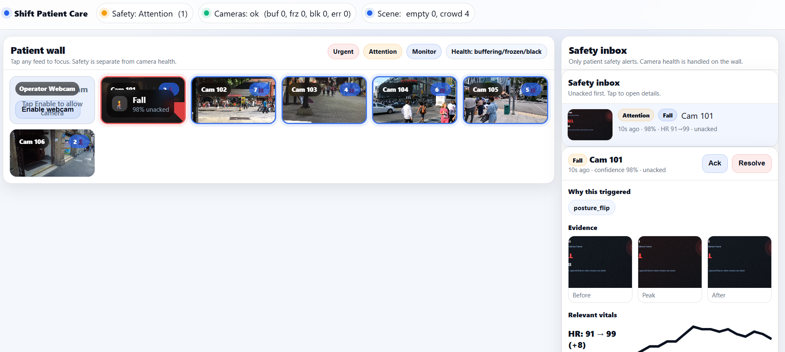

# Shift Patient Care



Shift Patient Care is a **video-first patient monitoring demo UI**.

It is designed to feel like a nurse station: a "patient wall" of many feeds for fast scanning, plus a safety inbox that pulls the few things that actually matter.

This repository is intentionally **frontend-only** and **demo-first**. It is meant for QA, stakeholder reviews, and product iteration.

## What you get

- **Patient wall (20 feeds)** optimized for a giant screen and mobile.
  - Tap any feed to focus it (mobile first behaviour).
  - Safety is a signal on the tile, not a giant card that hijacks the screen.

- **Safety inbox** (patient alerts only)
  - Fall and stillness events
  - Unacked first
  - Acknowledge and resolve flow

- **Camera health overlay** (camera quality, not a patient alert)
  - Buffering, frozen, black screen, decode errors
  - Highlighted directly on the affected tile

- **Evidence view**
  - Before / Peak / After frames (lightweight demo evidence)
  - "Why this triggered" reasons (explainability, not vibes)

- **Relevant vitals panel (demo)**
  - HR trend and deltas can be attached to an incident
  - In a real integration this would come from bedside monitors or wearables

## What this demo mixes (QA note)

To make the demo believable without any backend:

1) **A local patient fall clip** (MP4 in `public/`)
2) **Public pedestrian and traffic streams** (proxied through your domain)
3) **The operator webcam** (for interactive testing)

The goal is to show a realistic workflow even when half the feeds are not "medical".

## Technical overview

- Vite + React + TypeScript
- No server required for the UI itself
- Optional Nginx reverse proxy for public streams (to avoid CORS and enable pixel analysis)

### How detection works

This demo runs in the browser. There are two categories of signals:

#### 1) Patient safety alerts
These are meant to create inbox items.

- **Fall (risk, critical)**
  - The demo looks for a short, sharp event followed by a stillness confirmation window.
  - The best results come from person-aware signals (see "Client-side AI" below), but the demo can also operate in a motion-only mode.
  - Reasons can include:
    - posture flip (standing-like box becomes horizontal-like)
    - vertical drop (person center moves down quickly)
    - post-event stillness (low movement after the spike)

- **Stillness (watch)**
  - Low motion while a person is likely present.
  - Not the same as camera frozen. The camera can be healthy while the person is still.

Safety detection is usually enabled on:
- the patient fall clip feed
- the webcam

You can tighten or widen this rule set in the code (see "Configuration").

#### 2) Camera health
These are quality warnings for the feed itself. They should not spam the safety inbox.

- **Buffering**: `waiting` and `stalled` media events
- **Frozen**: `currentTime` not progressing for a threshold window
- **Black screen**: very dark frames for multiple samples (only when pixels are readable)
- **Error**: media error codes (network, decode, unsupported)


### Client-side AI (optional)

For richer demos, the UI can run lightweight vision on-device (no server round-trips):

- **TensorFlow.js** running in the browser (WebGL backend when available)
- **COCO-SSD** (person detection) to estimate:
  - per-tile person count
  - crowd flag when count >= 4
  - fall explainability features (box aspect ratio flip, center drop)

How it behaves:
- AI runs only when pixels are readable (same-origin media or webcam).
- If a stream becomes cross-origin via redirects, the browser taints the canvas and AI must disable itself.
  - Typical errors include `SecurityError: Tainted canvases may not be loaded` and `texSubImage2D: Tainted canvases may not be loaded`.
- The demo throttles inference to stay usable with many tiles. On low-end machines, reduce the number of active AI tiles.

If you do not enable the AI layer, the app still works using the heuristic motion probes, but people counts will be approximate or unavailable.

Install AI packages (only if your code branch uses them):

```bash
npm i @tensorflow/tfjs @tensorflow/tfjs-backend-webgl @tensorflow-models/coco-ssd

